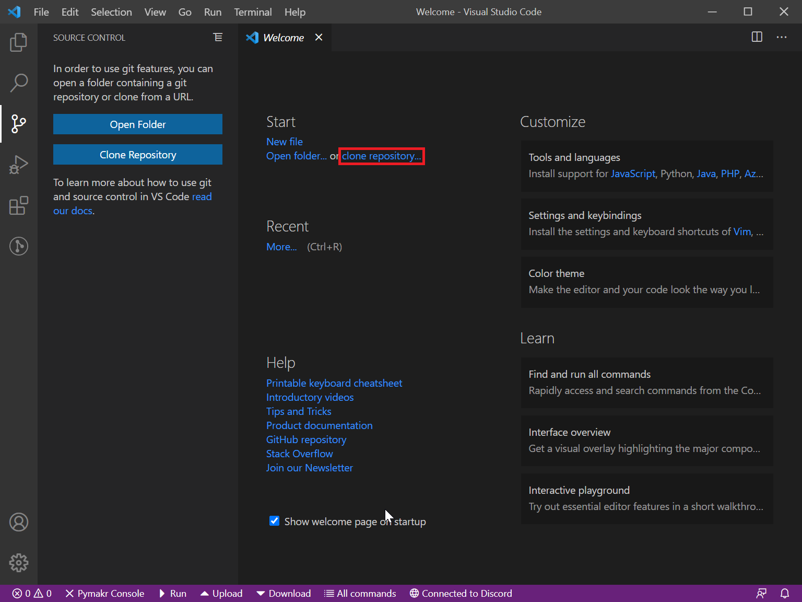
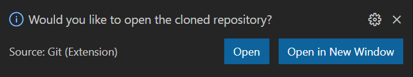
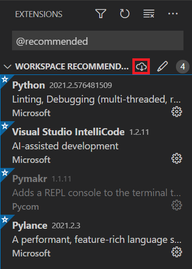
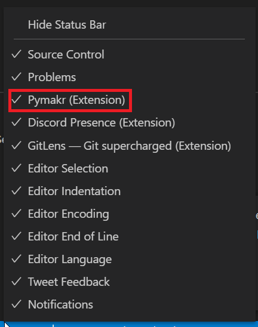
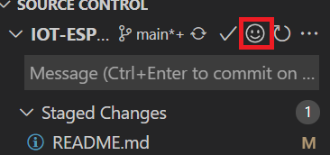

# IOT-ESP32

## How to get started?

### Requirements

* [Visual Studio Code](https://code.visualstudio.com/)
* [GitHub CLI](https://cli.github.com/) (optional)
* [Node JS](https://nodejs.org/en/) (used for Pymakr)

### Cloning the repo
#### A. Using github CLI
* Make sure you are signed into github CLI. `gh auth login` 
* Clone the repo. `gh repo clone USER/REPONAME`
* Get the subrepo's. `cd REPONAME && git submodule update --init --recursive`

#### B. Using Visual Studio Code
* Clone the repo using the url `GITURL`

* If you're not signed in you will be prompted to [sign in](https://code.visualstudio.com/docs/editor/github#_authenticating-with-an-existing-repository)
* After cloning you can open it using the button in the notification

* Open a terminal using <kbd>CTRL</kbd> + <kbd>Shift</kbd> + <kbd>\`</kbd>, and initaliaze submodules using `git submodule update --init --recursive`

### Setting up Visual Studio Code
* Search for recommended extensions by using <kbd>CTRL</kbd> + <kbd>Shift</kbd> + <kbd>X</kbd> and searching `@recommended`.
* Install them using the install button

## Usage instructions
Most extensions are very self-explanatory, but here are some instructions for the use of some of them.

### Pymakr
Pymakr is used for connecting to the ESP32 dev board and providing a way to upload and download code, as well as interacting with the terminal.
To use it you can use buttons on the status bar on the bottom. If they are not displayed, you might need to enable them by right clicking on the status bar and enabling them.

### Gitmoji
The extension is represented by an emoji button when using source control, and can be used very easily.

