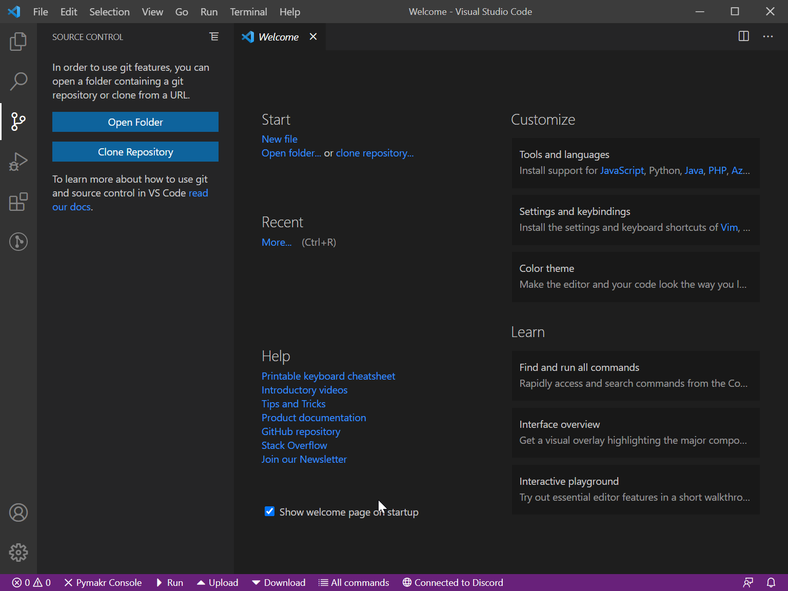

# IOT-ESP32

## How to get started?

### Requirements

* [Visual Studio Code](https://code.visualstudio.com/)
* [GitHub CLI](https://cli.github.com/) (optional)

### Cloning the repo
#### A. Using github CLI
* Make sure you are signed into github CLI. `gh auth login` 
* Clone the repo. `gh repo clone HanzeA1/IOT-ESP32`
* Get the subrepo's. `cd IOT-ESP32 && git submodule update --init --recursive`

#### B. Using Visual Studio Code
* Clone the repo using the url `https://github.com/HanzeA1/IOT-ESP32.git`

* If you're not signed in you will be prompted to [sign in](https://code.visualstudio.com/docs/editor/github#_authenticating-with-an-existing-repository)

### Setting up Visual Studio Code
* Open the project in VS Code and download the recommended extensions. `code .`
* Alternatively, recommended extensions can be seen by using <kbd>CTRL</kbd> + <kbd>Shift</kbd> + <kbd>X</kbd> and searching `@recommended`.
